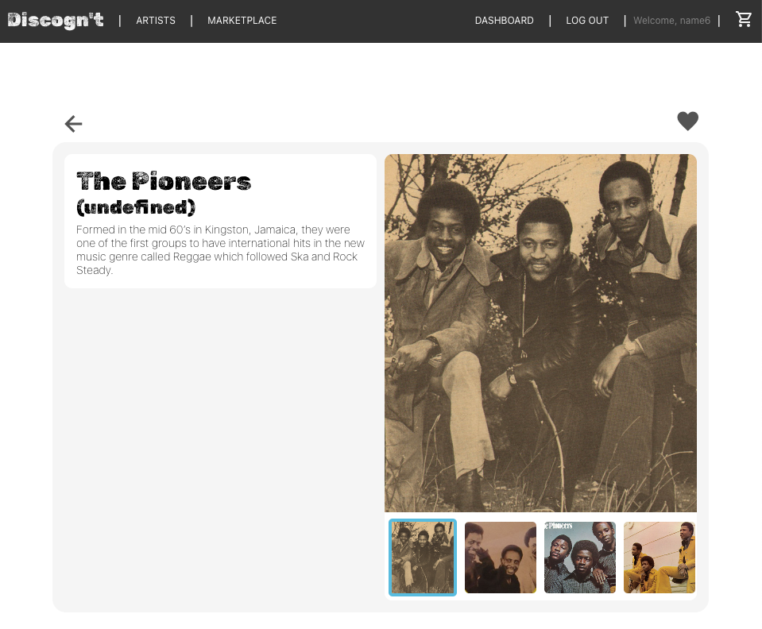

</img>

# **General Assembly Project 3: <br>Discogn't, a Discogs Marketplace clone**

### Outline

<!-- START doctoc generated TOC please keep comment here to allow auto update -->
<!-- DON'T EDIT THIS SECTION, INSTEAD RE-RUN doctoc TO UPDATE -->

- [Description](#description)
- [Deployment link](#you-will-find-the-deployed-version-here-todo-link)
- [Code Installation](#code-installation)
- [Timeframe & Working Team](#timeframe--working-team)
- [Technologies Used](#technologies-used)
- [Brief](#brief)
- [Planning](#planning)
- [Build/Code Process](#buildcode-process)
- [Challenges](#challenges)
- [Wins](#wins)
- [Key Learnings & Takeaways](#key-learnings--takeaways)
- [Bugs](#bugs)
- [Future Improvements](#future-improvements)

<!-- END doctoc generated TOC please keep comment here to allow auto update -->

## Description

This was my first time making a full stack application and also the first time working on an app as part of a group. 

The app is a clone of the Discogs marketplace. Users can search for music artists and albums in the Discogs database. They can look up information and images on the albums and artists, and sign up and log in to the app. Once logged in, users can buy albums, list their own copies of albums for sale, and add albums to a wishlist. The app is a full-stack application. The back end was created using an Express API and a Mongo database, and the front end was built with React.

<div align="center">
</img>
</div>
&nbsp;

### You will find the deployed version here: (TODO: link)

### Code Installation

* Clone or download the repo.
* In the terminal check that you have Node.js installed: `node --version`
* Create a .env file in the server folder and make sure it’s added to your .gitignore.
* These are the required environment variables:  DATABASE_URL, SECRET, DISCOG_KEY, DISCOG_SECRET. To get the discog_key and discog_secret you’ll need to register here: [https://www.discogs.com/settings/developers](https://www.discogs.com/settings/developers). 
* In the client folder run `npm install && npm run build`
* In the server folder run `npm install && npm start` 
* Start the client with `npm start` in the client folder.

### Timeframe & Working Team

We worked in a group of three. We completed the project in two weeks working on it part time, a few hours most days and sometimes all day.

The other team members were:

Ryan Cooper - [GitHub repo](https://github.com/ryangcooper96/SEI-Mod03-Discognt)

Matthew Pitkin - [GitHub repo](https://github.com/MJPitkin/Mod03-eCommerce)

### Technologies Used

#### **Front end:**

* JavaScript (ES6)
* React.js
* Node.js
* CSS3

#### **Back end:**

* Express
* MongoDB/Mongoose
* nodemon
* bcrypt
* disconnect
* jsonwebtoken
* ​​Stripe Node.js library

#### **API used:**

* Discogs API, available [here](https://www.discogs.com/settings/developers). 

#### **Dev tools:**

* VS Code
* npm
* Insomnia
* Git/Github
* Google Chrome Developer Tools
* Excalidraw (Wireframing, ERD, User Stories and timeline)
* (TODO: add tools used for deployment)

### Brief

* Build a full-stack application by making your own back end and your own front end.
* Use an Express API to serve your data from a Mongo database.
* Consume your API with a separate front end built with React.
* Be a complete product which most likely means multiple relationships and CRUD functionality for at least a couple of models.
* Implement thoughtful user stories/wireframes that are significant enough to help you know which features are core MVP and which you can cut.
* Have a visually impressive design.
* Be deployed online so it's publicly accessible.

## Planning

As this was the first time working in a team we wanted to be very clear on our process. We started by coming up with user stories and the features we wanted, dividing them into MVP and "nice-to-have" categories. Ryan and Matt focused on the front end. On top of this Ryan handled the styling and Matt worked on Stripe integration. I focused on the back end, wanting to get a really good understanding of how it works.

We used Excalidraw as our virtual whiteboard for wireframes, user stories and the ERD. This way everyone could see and follow each other's progress and thinking. This helped us stay organised and on track with our project. 

<div align="center">
</img><br>
<i>(Our virtual whiteboard)</i>
</div>
&nbsp;

<div align="center">
</img><br>
<i>(Wireframe examples)</i>
</div>
&nbsp;

These were the steps we implemented:

We chose an API and designed the ERD, going through several iterations. We created models for album listings, collections, carts, and users, and stored the data for these in MongoDB. We used the Disconnect library to pull album and artist data from the Discog API. We created routes, models and controllers with basic search functions available on the front end. We built pages for albums and artists with search functions. We added user authentication and the ability for users to buy and list albums for sale.

<div align="center">
</img><br>
<i>(The final version of the ERD)</i>
</div>
&nbsp;

To track progress we initially set up a Trello board. Later abandoned it in favour of using the user stories map as a visual aid. This proved to be very helpful for keeping track of progress. It ensured that the back end and front end were being built more or less in sync so we could test as we went. This worked really well for us. As we worked remotely we kept each other updated on Slack. We had Zoom meetings every 3 days or so, as well as impromptu calls when someone was stuck.

<div align="center">
</img><br>
<i>(Our user stories map)</i>
</div>
&nbsp;

## Build/Code Process

I used the Disconnect library to pull album and artist data from the Discog API. I implemented routes, models and controllers in the back end. After connecting these to the front end we had basic search functions available and could display album and artist data. I used URLSearchParams to string search parameters into a URL that would be used to query the API:

```
// all parameters optional (incl. query):
//
// searchArgs = {
// query: ""
// type: "release" || "master" || "artist" || "label"
// title: ""
// release_title: ""
// artist: ""
// label: ""
// genre: ""
// style: ""
// country: ""
// year: ""
// format: ""
// track: ""
// page: Number || 1,
// per_page: Number || 50, (100 max)
// }

function searchDatabase(searchArgs) {
 let query = new URLSearchParams(searchArgs).toString();
 return fetch(BASE_URL + "search/database?" + query, {
   method: "GET",
 }).then((res) => {
   if (res.ok) return res.json();
   throw new Error("Not found.");
 });
}
```

I set up a database in MongoDB and implemented user authentication using bcrypt to encrypt the password. We implemented signup and login functionality. We used JSON web tokens (JWT) to keep track of the signed-in user from page to page, including their cart and collection. 

The signup function also creates a cart and collection in the database for the user and associates it with the logged in user by their token: 

```
 const handleSubmit = async (e) => {
   e.preventDefault();
   try {
     await userService.signup(state);
     handleSignupOrLogin();
     // create collection and basket with user set as owner
     let ownerId = await userService.getUser()._id;
     await collection.create(ownerId);
     await cart.createCart(ownerId);
     navigate("/");
   } catch (err) {
     updateMessage(err.message);
   }
 };
```

I enabled users to list an album for sale by creating a listing and adding the user's ID from the logged in user's token.

I created a listing schema with information on the album it is connected to. It also includes reference fields pointing to the owner model and the cart model for when it is bought:

```
import mongoose from "mongoose";

const listingSchema = new mongoose.Schema(
 {
   albumId: String,
   title: String,
   format: String,
   condition: String,
   price: Number,
   description: String,
   in_collection: { type: mongoose.Schema.ObjectId, ref: "Collection" },
   in_cart: { type: mongoose.Schema.ObjectId, ref: "Cart" },
 },
 {
   timestamps: true,
 }
);

export default mongoose.model("Listing", listingSchema);
```

When a user buys an album the listing's "in_cart" field will be updated with the logged in user's cart ID. This allows the album to be added to the user's cart and it tracks the progress of the sale: 

```
// add listing to cart of logged in user
function addListingToCart(listingId) {
 const userId = loggedInUser(); // from token
 return cartId(userId)
   .then((cartId) => {
     let update = {};
     update.in_cart = cartId;
     return update;
   })
   .then((update) => {
     updateListing(listingId, update);
   })
   .then((listing) => {
     return listing;
   });
}
```

<div align="center">
</img>
</img><br>
<i>(On the left: the marketplace page, on the right: a search result page)</i>
</div>
&nbsp;

<div align="center">
</img><br>
<i>(An artist’s page example)</i>
</div>
&nbsp;

<div align="center">
</img><br>
<i>(An album page example)</i>
</div>
&nbsp;

### Challenges

* I was learning a lot as I went, especially how to use libraries and how they work. I felt I had to learn quickly so as not to hinder the team's work.
* I needed to get a good understanding of concepts that I had thought I was clear on, but realised I needed to do more thinking before proceeding, such as the difference between embedded data and referenced data.

### Wins

* I had a confidence boost from gaining more skills, especially compared to previous projects.
* We made a good-looking site that works well and we were very happy with it.
* We managed to build all MVP features.
* I got a better understanding of how to use Git as a team, including feature branches and avoiding merge conflicts.
* The lovely team dynamic contributed to such a positive experience overall.

## Key Learnings & Takeaways

#### Fundamental concepts:

Working on this project helped me solidify my understanding of some fundamental concepts. For example the correct use of referenced data vs. embedded data, Express and the MVC model, and working with databases. I also gained a good understanding of how the back end and front end connect. Also this was the first time I used a library (Disconnect), and I saw how much time it saved us. 

#### Project management and organising my work:

In terms of project management I took on a bit of responsibility for the group. I took the initiative to map the user stories after our discussions. Later I made this our progress tracking tool when we abandoned Trello. I found that this map made it easy to see what to work on next and to anticipate what the other team members would need.

This way of tracking tasks proved to be very useful. We relied on asynchronous communication often and only had a few long group meetings. We were working remotely and part-time while also working in our day jobs. Despite this we stayed on track and made good use of our time.

My work method improved a lot as well. I became much more methodical about how I proceed through the list of features in a logical order.

#### Team work:

In terms of teamwork I didn’t know I was going to love working in a team this much. Seeing the progress much faster than in my previous project was very encouraging. Troubleshooting and problem-solving together was much faster and less frustrating than working alone. This was partly because we had more ideas, but the social element also eased the pressure. I learned that I benefit from sharing my thinking and "narrating my work" more as I go, so that the team can have an input.

It was a lovely experience and a lovely team.

## Bugs

* The user clicks on an album/artist from a list of search results and navigates to their page. When navigating back with the “Back” button we get to the all albums/all artists page instead of the search results.
* Null values from the API are not filtered out and show on the page as “undefined”.
* Links to other artists/albums in descriptions or bios are not turned into actual links. So in the text a linked artist's name would be a code, for example: “later in 1970 singer [a79949] came up with the new name for the band”.
* Album pages that have listings for sale only load for logged in users.

## Future Improvements

* Checkout fully functional, including shipping method, Stripe payment and updating inventory.
* A wishlist and notification email when wishlist items become available.
* Sorting album listings by price, condition or seller rating.
* Infinite scrolling.
* Artist page listing their albums.